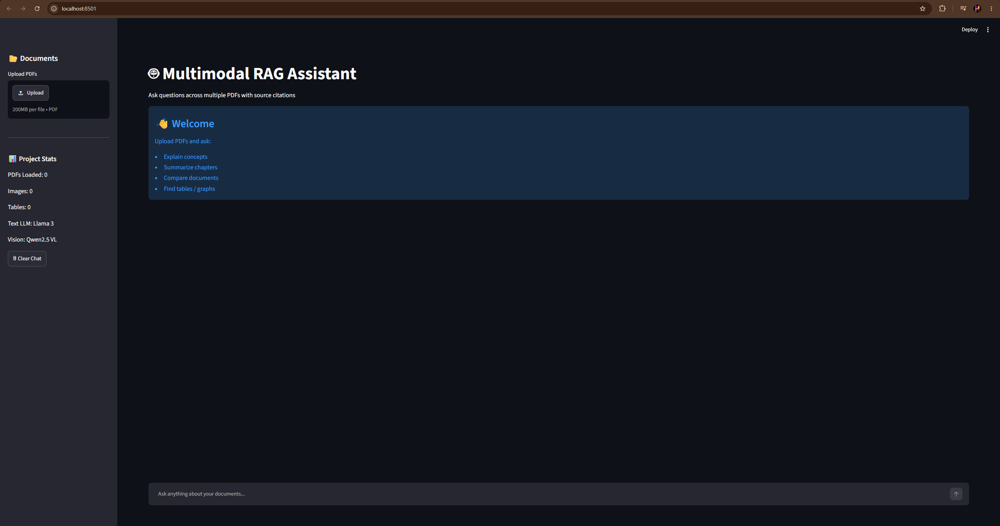
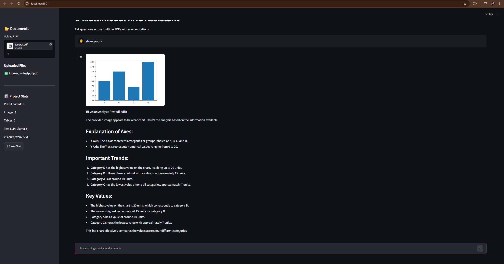
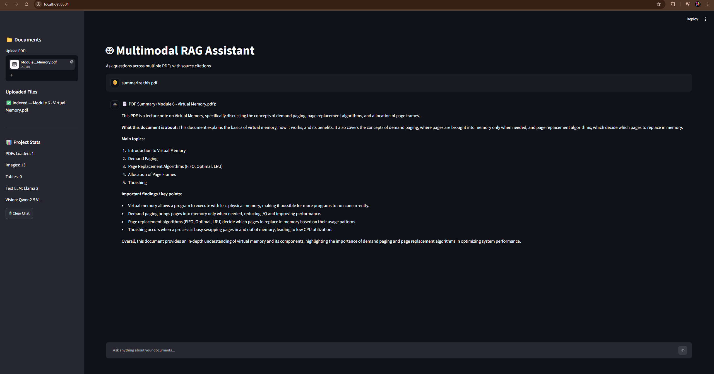
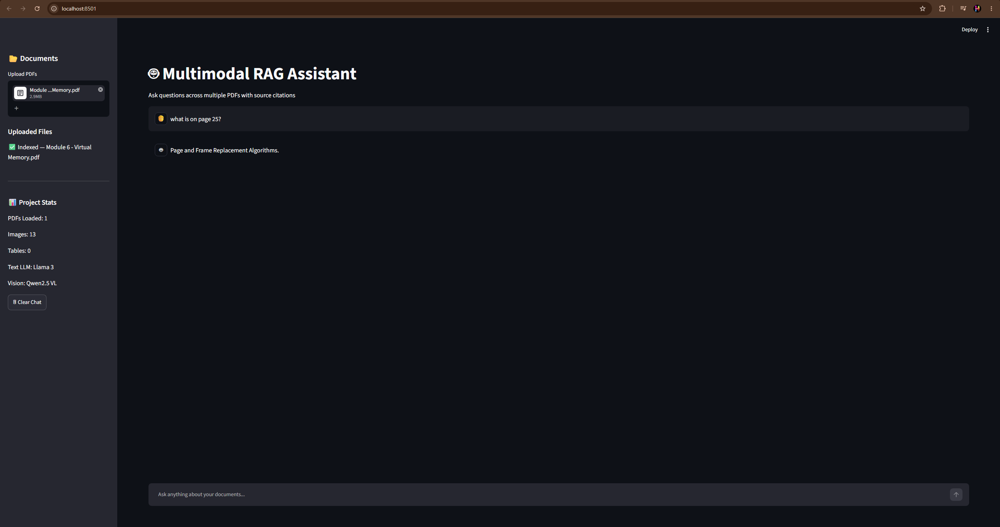
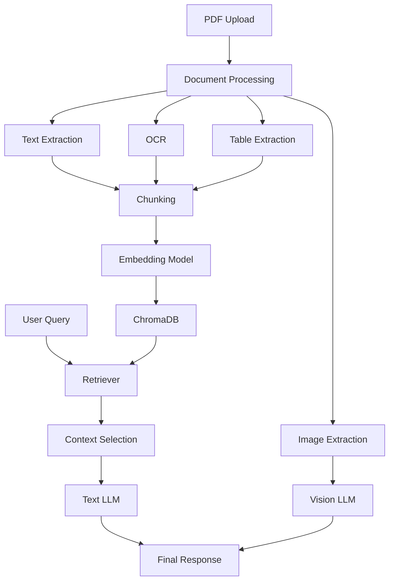

<p align="center">
  <h1 align="center">🤖 Multimodal RAG Assistant</h1>
  <p align="center">
    An AI-powered document assistant capable of understanding text, scanned PDFs, tables, charts, and images using Retrieval-Augmented Generation (RAG), OCR, and Vision Language Models.
  </p>
</p>

<p align="center">
  
  
  
  
  
</p>

<p align="center">
  <a href="https://github.com/TheHarshUp/multimodal-rag-assistant">GitHub Repository</a>
</p>

---
# 📌 Overview

Traditional RAG systems work well on text-heavy documents but struggle with:

- Scanned PDFs
- Graphs and charts
- Images / figures
- Tables
- Page-specific queries

This project solves those limitations by building a **Multimodal RAG pipeline** that combines:

- Semantic retrieval
- OCR
- Vision Language Models
- Page-aware querying

The assistant can answer questions from multiple uploaded PDFs while understanding both textual and visual content.

---

# ✨ Features

✅ Multi-PDF upload support  
✅ Semantic document search with embeddings  
✅ OCR for scanned/image-based PDFs  
✅ Automatic image extraction  
✅ Chart / graph detection using VLM  
✅ Table extraction and visualization  
✅ Page-specific querying  
✅ PDF summarization  
✅ Local LLM inference (privacy-friendly)  

---

# 📸 Screenshots

## Home Interface
Upload PDFs and chat with documents.

<p align="center">
  
</p>

---

## Graph Detection & Vision Analysis
Charts and graphs are automatically detected and routed to a Vision Language Model for analysis.

<p align="center">
  
</p>

---

## PDF Summarization
Generate concise summaries of large academic or technical PDFs.

<p align="center">
  
</p>

---

## Page-Specific Retrieval
Ask highly specific questions such as:

> What is written on page 25?

<p align="center">
  
</p>

---

# 🏗 System Architecture



---

# ⚙️ Tech Stack

## Frontend
- Streamlit

## Backend
- Python

## Vector Database
- ChromaDB

## Embeddings
- Sentence Transformers (`all-MiniLM-L6-v2`)

## Text LLM
- Meta Llama 3 (via LM Studio)

## Vision LLM
- Qwen 2.5 VL 7B

## OCR
- EasyOCR

## Document Processing
- PyPDF
- Pandas
- Pillow

---

# 📂 Project Structure

```bash
multimodal-rag-assistant/
│
├── app.py
├── requirements.txt
├── screenshots/
├── uploads/
│
├── utils/
│   ├── pdf_reader.py
│   ├── chunker.py
│   ├── embedder.py
│   ├── vector_store.py
│   ├── llm.py
│   ├── vision_llm.py
│   ├── image_extractor.py
│   ├── table_parser.py
│   └── ocr.py
│
└── chroma_db/
```

---

# 🔄 Pipeline

## 1. Document Processing
Uploaded PDFs are processed to extract:
- Text
- Images
- Tables

## 2. OCR Fallback
If a page has little or no selectable text, OCR is used.

## 3. Chunking
Document text is split into smaller overlapping chunks.

## 4. Embeddings
Each chunk is converted into vector embeddings.

## 5. Retrieval
Relevant chunks are retrieved using semantic similarity.

## 6. Response Generation
A local LLM generates answers using retrieved context.

## 7. Vision Routing
Visual queries are routed to the Vision Language Model.

---

# 💬 Example Queries

- Summarize this PDF  
- Explain chapter 3  
- What is written on page 25?  
- Show graph on page 4  
- Explain this chart  
- What does table 2 contain?  

---

# 🧠 Challenges Solved

This project addresses several real-world multimodal AI challenges:

- OCR integration for scanned documents  
- Page-aware retrieval  
- Graph detection from mixed-content PDFs  
- Hybrid text + vision routing  
- Handling large academic PDFs efficiently  

---

# 📈 Future Improvements

- Cloud deployment  
- Faster GPU inference  
- Better table extraction  
- Citation highlighting  
- Chat history persistence  
- PDF annotation support  

---

# 🛠 Installation

Clone repository:

```bash
git clone https://github.com/TheHarshUp/multimodal-rag-assistant.git
cd multimodal-rag-assistant
```

Create virtual environment:

```bash
python -m venv venv
venv\Scripts\activate
```

Install dependencies:

```bash
pip install -r requirements.txt
```

Run application:

```bash
streamlit run app.py
```

---

# 👨‍💻 Author

**Harsh Upadhyay**

AI / ML • RAG Systems • Multimodal AI